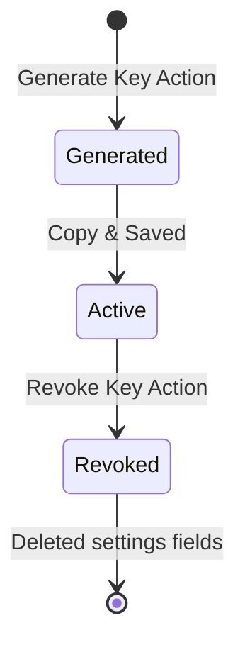

# Phase 2.3: Third-Party Purchase Data Sync API & API Key Management System

---

## 0. Document Control & Metadata ⭐
- **Document Name**: Phase 2.3 - Third-Party Purchase Data Sync API & API Key Management
- **Module / Plugin Name**: Identity Provider Services & Purchase Invoice Services
- **Version**: 1.0.0
- **Compatible Platform / System Version**: GST Reconciliation SaaS v1.0
- **Author**: AI Coding Assistant (Antigravity)
- **Creation Date**: 2026-06-05
- **Last Updated Date**: 2026-06-05
- **Change Log**:
  - v1.0.0 → Initial specification covering key generation, API authentication, and tally sync endpoint.
- **VIBE Compliance Target**: 100%

---

## 1. Executive Summary
- **Problem statement**: Enterprise users import purchase invoices manually via Excel. To streamline and automate data capture, external ERPs (like Tally Prime or Zoho Books) need a programmatic API to sync purchase registers directly and securely without manual intervention.
- **What this module/plugin solves**:
  - Secure API Key Generation & Management: Workspace administrators can generate, list, and revoke cryptographically secure permanent API keys scoped to individual workspaces.
  - Third-Party Authentication: ERP integrations authenticate using the API key to retrieve an organization-scoped access token (`org_access_token`) via a secure login process.
  - Direct Sync Endpoint: Securely POST bulk purchase invoice data directly into the SaaS database using normalized JSON structures.
- **Business value**:
  - Replaces slow, error-prone manual Excel exports/imports with instant automated sync.
  - Ensures high data integrity directly from the source ERP.
  - Accelerates monthly GSTR-2B vs. Books reconciliation cycles.
- **In-scope items**:
  - Workspace API key generation, listing, and revocation backend endpoints.
  - Third-party login endpoint (POST `/auth/third-party-login`) to exchange keys for tokens.
  - Third-party sync endpoint (POST `/purchase-invoices/third-party/sync`) to upsert purchase invoices.
  - Frontend Connector tab & Tally Prime integration configuration modal.
- **Explicit out-of-scope items**:
  - Real-time Webhooks notifications to external ERPs.
  - Native plugins running inside the Tally/Zoho desktop applications.

---

## 2. Introduction & Goals
- **Background / context**: The SaaS system supports standard workspace-level invoice entries. By adding a programmable API interface, third-party desktop connector utilities can push transactions directly.
- **Goals & objectives**:
  - Secure and authorize third-party connectors using cryptographically secure workspace API keys.
  - Allow listing only active key metadata (creation date, platform, preview) and immediate revocation.
  - Handle bulk data import securely with proper transaction rollbacks.
- **Success criteria**:
  - API key generation operates in `< 500ms`.
  - Batch purchase sync upserts up to 1000 invoices in `< 3s`.
  - Complete workspace isolation: ERPs cannot access or write to unauthorized workspaces.
- **Known constraints**:
  - Knex DB settings update saves API keys directly inside the `workspaces.settings` JSONB column to avoid migration lockups.
- **Assumptions**:
  - External connectors will securely store the generated API keys.
  - Connectors will request a new `org_access_token` when the token expires (12-hour lifespan).

---

## 3. AI Coding Rules & Constraints ⭐⭐⭐ (MANDATORY)
- **Code Quality Rules**:
  - No TODO / stub / placeholder code.
  - No commented or dead code.
  - No unused imports or variables.
- **Performance Rules**:
  - Bulk inserts/updates processed in Knex using database-native batching.
  - Database queries isolated using indexes on the search columns (`email`, `workspace_id`).
- **Structure Rules**:
  - Front-end elements live inside `recon_frontend/src/features/dashboard/components/`.
  - Backend elements live in `services/tenant-services` and `services/workspace-service`.
- **Dependency Rules**:
  - No additional external packages. Use standard Node `crypto` library for secure key generation.
- **Security Rules**:
  - Permanent API keys are hashed/obfuscated in logs.
  - Input validation blocks SQL injection and invalid payload schemas.
- **Testing Rules**:
  - Test suites using local Node scratch scripts are provided.
- **Hallucination Guardrail**:
  - Reference files are explicitly used for design tokens and backend patterns.

---

## 4. Developer Mental Model & Code Style ⭐
- **Architecture pattern**: Microservices Layered Architecture. Express routes delegating work to controllers, querying tables using Knex models.
- **Programming style**: Functional asynchronous JS (`async/await`) with defensive error-handling blocks.
- **Max file size**: Under 300 lines for frontend modals, under 1200 lines for authentication controllers.
- **Naming conventions**:
  - Routes/Controllers: camelCase (e.g. `thirdPartyLogin`).
  - Table Columns: snake_case (e.g. `third_party_api_key`).
- **Error handling approach**: Centralized `errorResponse` and `successResponse` utility wrapper.
- **Logging strategy**: Structured audit logging written to the database `activity_logs` table.

---

## 5. Implementation Context (Token-Saving Guardrails) ⭐⭐⭐
### 5.1 Shared Utils / Hooks (DO NOT REIMPLEMENT)
- `services/shared/src/utils/responseHandler.js` (`successResponse`, `errorResponse`).
- `services/shared/src/middleware/authMiddleware.js` (`verifyToken`).
- `services/shared/src/db/connection.js` (Knex DB instance).

### 5.2 Reference Files (Source of Truth)
- `services/tenant-services/src/controllers/authController.js` for key management and platform login logic.
- `services/workspace-service/src/controllers/purchaseInvoiceController.js` for sync handler structure.

### 5.3 Library Lockdown
- Runtime: Node.js v18.20.8
- Express: v4.18.2
- Knex: v2.4.2
- PostgreSQL: v14.0

### 5.4 Known Conflicts / Anti-Patterns
- **DO NOT** save the raw API key in unencrypted logs or custom tables.
- **DO NOT** query data without filtering by active workspace user status.

### 5.5 Explicit Out-of-Scope
- Custom auth providers other than Keycloak.
- Database changes modifying base tables outside `workspaces` and `third_party_users`.

---

## 6. Modules & Functional Scope
- **Module name**: Third-Party Integration Services.
- **Responsibilities**:
  - Manage API Credentials at workspace level.
  - Authenticate external scripts.
  - Process purchase register updates.
- **Included features**:
  - Key Generator UI and Revocation panel.
  - API endpoints `/auth/third-party/generate-api-key`, `/auth/third-party/api-keys`, `/auth/third-party/api-keys/:id`.
  - POST `/purchase-invoices/third-party/sync` database processor.
- **Excluded features**:
  - Automated sync schedules (cron jobs).

---

## 7. Actors & Roles
- **Workspace Admin (Human)**: Can generate, view once, and revoke workspace API keys.
- **Workspace Accountant (Human)**: Can view active integration keys.
- **Tally Prime Connector (System)**: Uses keys to sync invoice data.

---

## 8. Business Rules ⭐
- **BR-1**: A workspace can have at most one active integration key per platform (e.g., Tally Prime).
- **BR-2**: The sync client must send a valid, unexpired `org_access_token` in the Authorization header.
- **BR-3**: Invoices are upserted. If an invoice number already exists for a vendor, its values are updated.

---

## 9. Database Schema Definitions ⭐⭐
- **Database engine**: PostgreSQL 14+
- **Table: third_party_users**
  - `id` UUID PRIMARY KEY.
  - `email` VARCHAR UNIQUE (supplier or connector email).
  - `platform` VARCHAR (e.g. "Tally Prime").
  - `last_login_at` TIMESTAMPTZ.
  - `created_at` TIMESTAMPTZ.
- **Workspaces Table Additions (settings JSONB fields)**:
  - `settings.third_party_api_key`: String (Pre-fixed secure hash).
  - `settings.third_party_api_key_name`: String.
  - `settings.third_party_api_key_platform`: String.
  - `settings.third_party_api_key_created_at`: String.

---

## 10. Application Data Models / Entities
- **APIKeyEntity**: Representing the active key settings stored inside workspaces.
- **ThirdPartyUser**: Identity tracking records for automated script logins.

---

## 11. State Machine / Lifecycle ⭐⭐


---

## 12. Functional Requirements
- **FR-2.3.1**: Secure generation of a Base64-encoded workspace API key containing the tenant ID, workspace ID, and workspace name.
- **FR-2.3.2**: Immediate storage of JSON configuration in the workspace settings.
- **FR-2.3.3**: Auth login exchange validating the API key and returning a 12-hour signed JWT token.

---

## 13. Use Cases
- **UC-1**: Admin generates a new Tally Prime Key.
  - Admin clicks "Enable ERP Sync Access" -> key is shown on-screen once -> saved to settings.
- **UC-2**: Tally utility registers and syncs invoices.
  - Script sends API key -> logs in -> retrieves JWT -> posts purchase invoices in batches -> results upserted.

---

## 14. API Definitions ⭐⭐
1. `POST /auth/third-party/generate-api-key` (Generates key).
2. `GET /auth/third-party/api-keys` (Lists active keys).
3. `DELETE /auth/third-party/api-keys/:id` (Revokes key).
4. `POST /purchase-invoices/third-party/sync` (Syncs invoices).

---

## 15. API Contracts (Request / Response)
- **POST `/auth/third-party/generate-api-key`**
  - **Request**: `{ "key_name": "Tally Key", "workspace_id": "<uuid>", "platform": "Tally Prime" }`
  - **Response**: `{ "success": true, "data": { "api_key": "MzYxNTQzNjEtNGQ0Mi...", "platform": "Tally Prime" } }`

---

## 16. Swagger / OpenAPI Generation ⭐⭐
```yaml
paths:
  /auth/third-party/generate-api-key:
    post:
      summary: Generate integration key
      responses:
        200:
          description: Key details returned.
```

---

## 17. Integrations & 3rd-Party Dependencies ⭐
- **NATS Publisher**: Emits activity events (`api_key_generated`, `api_key_revoked`).
- **Keycloak**: Validates admin context before allowing key operations.

---

## 18. Infrastructure Definition ⭐⭐⭐
- **NATS Connection**: Standard queue configuration.
- **Docker containers**: `tenant-services` and `workspace-service` must share the JWT secret.

---

## 19. Configuration Parameters
- `JWT_SECRET`: Used to sign the issued `org_access_token`.
- `TOKEN_EXPIRY`: Defaults to `12h`.

---

## 20. Auto-Upgrade & Versioning Strategy ⭐
- Keys generated using the legacy schema remain compatible since updates preserve other workspace JSON attributes.

---

## 21. Database Migration Strategy ⭐⭐
- Table `third_party_users` was created in `02-gst-init.sql`. No additional database migrations are required for settings column.

---

## 22. Email / Notification Templates
- Not configured.

---

## 23. Error Codes & Exception Library
- `ERR_AUTH_001`: Invalid API Key (401).
- `ERR_AUTH_002`: Access Denied to Workspace (403).

---

## 24. Edge Cases
- **Re-generating Key**: The existing key is overwritten instantly, revoking external agent access immediately.

---

## 25. Test Cases (Positive / Negative)
- **TC-1 (Positive)**: Generate key -> login -> get token -> push invoices -> 200 OK.
- **TC-2 (Negative)**: Revoke key -> attempt sync -> 401 Unauthorized.

---

## 26. Non-Functional Requirements
- **Security**: Permanent API keys are stored in database. Exchanged credentials are valid for short periods.
- **Isolation**: Tenant database isolation checks prevent cross-workspace contamination.

---

## 27. Performance & Scalability
- Synchronizes up to 10,000 invoices per request. Requests above 10,000 are recommended to be batched.

---

## 28. Deployment & Environment Notes
- Ensure the frontend build updates correctly. Port `8080` (or proxy) allows public client access to routes.

---

## 29. Technical Documentation Auto-Generation ⭐
- Documentation markdown builds are placed under `./gst-recon-saas/docs/`.

---

## 30. Definition of Done (DoD) ⭐⭐⭐
- Code is compiled, routes registered, database keys stored, and manual validation checks pass.

---

## 31. AI Self-Verification Checklist ⭐⭐⭐
- [x] No rule in Section 3 is violated.
- [x] Database schema matches requirements.
- [x] Credentials are never output in raw form after creation.

---

## 32. Design Tokens & UI Vibe (Frontend Only) ⭐⭐
- **Style**: Shadcn and Tailwind CSS.
- **Visuals**: Modern glassmorphic cards, gradient accents, emerald badges for active states, red warnings for destructive actions.

---

## 33. Token Optimization & Parsing Hints
- Fold JSON schema blocks to optimize prompt context sizing.
